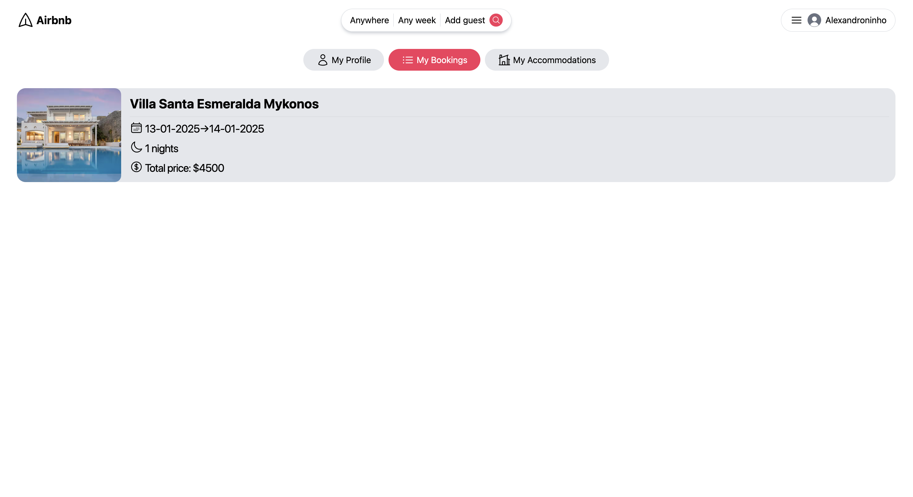
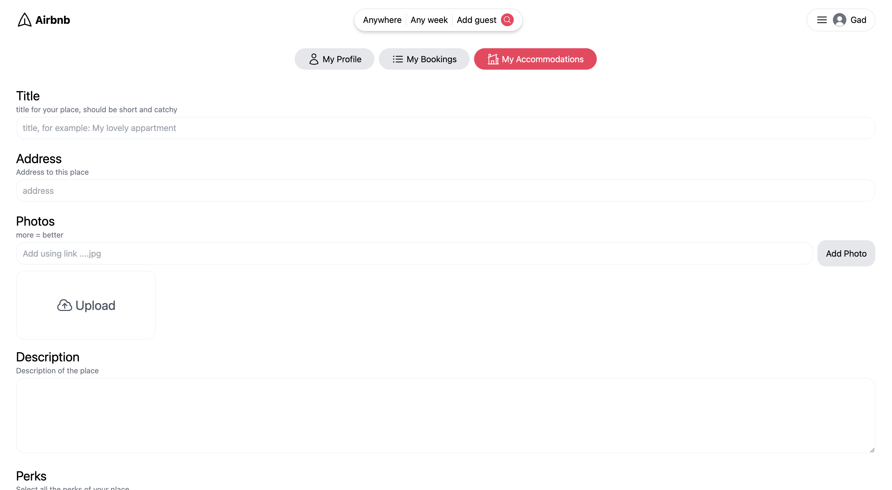

# 🌟 [Airbnb Clone]

A modern web application replicating the core functionality of **Airbnb**, built with **React**, **TypeScript** and **Tailwind CSS**. The project enables users to create accommodations, search for bookings, validate reservations seamlessly...


---

## 🖼️ **Screenshot**






## 🚀 **Features**

- 🏠 **Create Accommodations**: Add new accommodations with detailed descriptions and photos.
- 🔍 **Search Bookings**: Search from the homepage your futur booking.
- ✅ **Validate Bookings**: Confirm and manage reservations in real time.
- 🖼️ **Responsive Design**: Fully optimized for all screen sizes and devices.
- 🖱️ **Interactive UI**: Enjoy smooth animations and user-friendly interfaces.

---

## 🛠️ **Tech Stack**

| **Category**   | **Technologies**                         |
|----------------|------------------------------------------|
| Frontend       | React, TypeScript, Tailwind CSS          |
| Backend        | Node.js, Express                         |
| Database       | MongoDB                                  |
| Authentication | JSON Web Tokens (JWT)                    |

---

## 💻 **Installation**

1. Clone the repository:

   ```bash
   git clone https://github.com/gadnadj/Airbnb-Frontend.git
   git clone https://github.com/gadnadj/Airbnb-Backend.git
   
4. Navigate to the project directory:

   ```bash
   in two different terminals:
   cd Airbnb-Frontend
   cd Airbnb-Backend

5. Install dependencies:

   ```bash
   For the two terminals:
   npm install

7. Start the development server in the backend terminal:

   ```bash
   nodemon index.js

8. Start the development in the frontend terminal:

   ```bash
   npm run dev

9. Open your browser and navigate to:

   ```bash
   http://localhost:5173

In the project directory, you can run:

npm run dev: Start the development server.
npm run build: Build the project for production.
npm run preview: Preview the production build.
